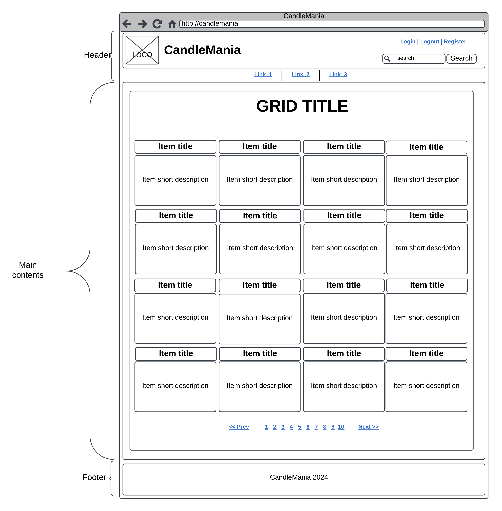
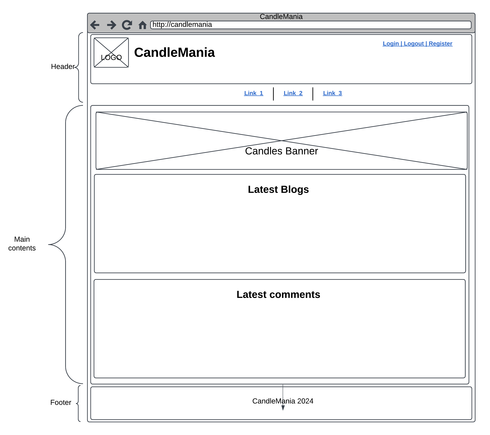
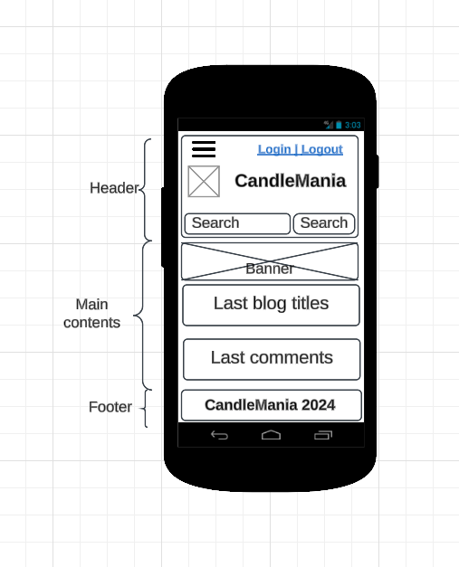
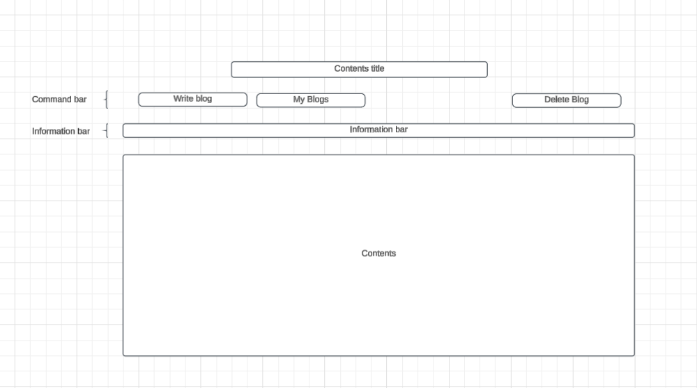
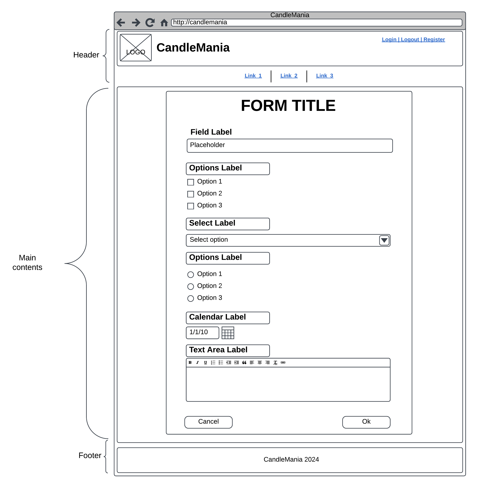
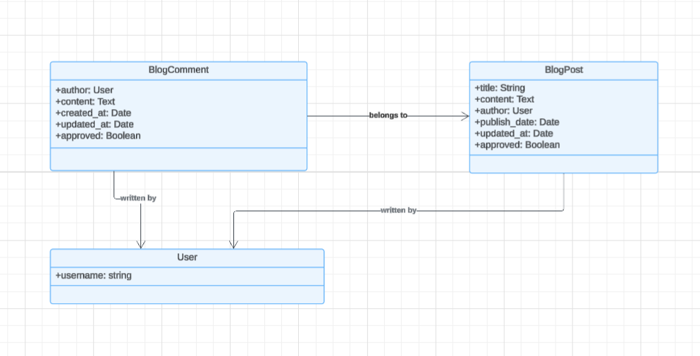

Candle Mania
=================

Link to production site: [CandleMania Project](https://candlemania.projects.andris.jancevskis.com/)

# Introduction

Candle Mania is a blog website dedicated to candles, serving as a valuable resource for candle 
enthusiasts. It provides information on candle-making techniques, various candle types, 
and their applications. It explores topics such as scent selection, candle care, DIY tutorials, 
and the impact of candles on ambience and well-being.

This blog site may review popular candle brands, safety tips, and creative ways to incorporate candles into home decor or special occasions. 

The overall purpose is to educate, inspire, and engage individuals who are passionate about candles.

**The intended audience** for the site include:

1. **Candle Enthusiasts** – People who love candles for their ambiance, scent, and decorative appeal.
2. **DIY & Craft Lovers** – Those interested in making their own candles as a hobby or small business.
3. **Home Decor Enthusiasts** – Individuals looking for creative ways to use candles in their living spaces.
4. **Aromatherapy & Wellness Seekers** – People who use candles for relaxation, stress relief, and mood enhancement.
5. **Gift Shoppers** – Those searching for unique and personalized candle gifts.
6. **Eco-Conscious Consumers** – Individuals interested in sustainable, non-toxic, or handmade candles.
7. **Small Business Owners** – Artisans or entrepreneurs in the candle-making industry looking for tips and trends.

The blog would cater to anyone who appreciates the beauty, function, and sensory experience of candles!

Anyone is welcome to browse blogs and read comments. Want to leave a comment or even write a blog yourself?
Register and go ahead! To have an impact on site's content, became an editor often called a moderator.
Get in touch by email: andris [at] jancevskis [dot] com


## Users

There are four categories of users: a visitor, a registered user, an editor and a superuser.

A **visitor** can browse approved blogs and comments.

A **registered user** can do everything a visitor can and add, edit, and delete its blogs 
and approve and delete other user comments to its blog.

An **editor** can accept blogs.

A **superuser** can appoint a registered user to editor.

## Used technologies, frameworks, services

- HTML
- CSS
- JavaScript
- Python
- Django
- PostgreSQL
- Git
- GitHub
- Grammarly to catch grammar slips and improve the text

## Intended audience

This project's intended audience is anyone who is interested into information about candles.

Project assessors and recruiters are welcome.

# Development
This part is dedicated to the page's development.
## Development process
The Development of this site includes consequently following the stages described in detail in the next sections:
* Requirements gathering described in Strategy Plane – gathering all requirements to the Site. User Stories belong to this stage. 
* Scope definition described in Scope Plane – defining what will be included in the first release.
* The Structure plane is introduced at the start of the design, where wireframes are used to create sketches of the pages, and Entity-Relationship Diagrams (ERD) show the database structure.
* The result of a Skeleton plane is the Site’s navigation and detailed database description.
* The last in Development comes the Surface plane, where all design is completed for various screen sizes and audiences. This plane includes all JavaScript and CRUD functionality.
* Then comes the Site testing, which is performed manually using Jigsaw (CSS) and W3 Validator (HTML). Google’s Lighthouse test is used to test the site’s performance. JavaScript's syntax is tested using Beautify Tools. The database is tested by inserting data using UI and validating inserted and updated data using UI or database tools to read data directly in the database.

## Strategy plane
**User stories**
* as a site's visitor I need to
  * [US-V01] browse all blogs
  * [US-V02] have a paginator when there are more than 8 items on a page grid mode
  * [US-V03] read the full blog
* as a registered user I need to
  * [US-RU01] be able to do the same a visitor can
  * [US-RU02] be able to log in
  * [US-RU03] have a registration page
  * [US-RU04] write a blog
  * [US-RU05] update my a blog
  * [US-RU06] delete my a blog
  * [US-RU07] comment a blog
  * [US-RU08] approve blog comments to my posts
  * [US-RU09] delete my blog comments
  * [US-RU10] have my blogs protected from altering by other users
  * [US-RU11] have my blogs protected from deleting by other users
  * [US-RU12] have my comments protected from altering by other users
  * [US-RU13] have my comments protected from deleting by other users
* as an editor I need to
  * [US-A01] be able to do the same as a registered user
  * [US-A02] approve any blog
  * [US-A03] delete blog
* as a superuser I need to
  * [US-SU1] list all registered users
  * [US-SU2] grant registered user an editor role
  * [US-SU3] revoke the editor role


Site's development is performed using JetBrain's PyCharm IDE, Python version 3.12 and Django version 5.1.4.
Site uses the database PostgreSQL v16 for storing data.
Git and GitHub is used for storing code and version control.

## Scope plane
The user stories above show full functionality of the site. However, due to certain circumstances user permission 
functionality can be reduced up to the registered user. 

At the end of development will be delivered:
* Implemented User Stories
* README.md file
* Development documentation in README.md file, in particular:
  * Requirements,
  * Testing process in a separate file,
* Deployment to cPanel hosting.
* Code and version control using Git and GitHub

## Structure plane
The structure plane is concerned with design elements on pages.

**Wireframes** allow seeing what will be on pages. There is no detailed design or colours (in most cases); schematic elements only are placed on a page.

For listings like list of blogs grid list with paginator is used as a reusable component like main contents in the following image.


The home page contains the news: the newest blogs and the newest comments. It is possible to add new blocks by
adding a new menu item.

**Desktop version**



**Mobile version**



**Contents structure**

Page contents depend on its functionality. This document does not describe how exactly each page should look, but it 
gives a structure with a bits that page can be combined with. For example, About page is static text only, and blog pages can 
contain different set of buttons on the Command bar for different users. Information bar contains feedback from user actions.



Data entry form shows how each element in a form will look like.



## Skeleton plane
Skeleton Plane is concerned about the functionality of the site including database structure.

**Entity-Relationship Diagrams** (ERD) show relationship between [data] entities. 
It is a starting point of a database design, and it affects site's navigation and design.



The resulting database structure is described in file [Structure](structure.md).

**Navigation**
The site has two menu's: The Main menu and a Command bar.

The main menu is a bar of links which belongs to page's header. It is static and menu item is 
greyed out when opened page is on the menu item's area.

**Authorisation and authentication**

The site uses allauth module for authorisation and authentication. On the top right corner are links for registration 
and authorisation. Only user's self-registration and sign in and sight out functionality is supported.
Registered user is promoted to an editor using admin interface and a created role Editor can be added to the 
user's role list (currently no other roles are supported).

**Search**

Every page's header has an input field and a Search button to search blogs by title and content.
The result is displayer in a grid list.

**Command bar**

Command bar in the blog area has different buttons depending on page and user access rights.
* visitor: "Write a Blog", "My Blogs". When pressed system will ask to log in.
* registered user: "Write a Blog", "My Blogs" in the lists; On his own blogs: "Edit", "Delete".
* editor: "Write a Blog", "My Blogs", "Approve Blogs" in the lists; 
in blog details: "Approve" if not approved, "Delete". "Edit" button if it is user's blog details.
* superuser acts as a registered user on the site. 
If superuser has an "Editor" role assigned, it acts as an editor.

Blog comment may have "Approve" and/ or "Delete" buttons between author name and a comment.
Comment can be added by any registered user. Registered user can delete its own comment.
The blog author can approve and delete any comment left for that blog.

**Paginator** appears when there is more than one page (8 items) in the list as a bar of numbers and arrows.
Arrows are shows when there is at least one page to navigate to the arrow's direction (left or right).

**Blog text**

Users can write blogs and do some basic formatting like indentation or making text Italic or Bold.
To achieve this django-tinymce package is used.

Allowing html tags in the public domain may cause security issues. To address them a package bleach is used.
It allows catching unwanted HTML tags and converts them to text for showing on web page.

## Surface plane
All pages are designed to adapt seamlessly to various screen sizes. Whether it's a desktop, tablet, or mobile screen, the user experience remains consistent and optimal.

**Menu** collapses on the mobile size.

Due to the small project size, there is no design mock-up, and all elements will be built during development using the try-and-fix method.

### Page Colours
Page base colours are:
* page background: #fafafa
* header area above menu: #f3e0d1
* Menu background: amber
* Command bar buttons: #2dc26b
* Footer background: #f3e0d1
* Fonts: black

### Behavioural colours
Active menu item: bold, opacity 25%
Delete button hover: red
Other buttons hover: green

### Information bar colours
Information bar colours depends on what kind of information is to be shown:
* debug: background #6c757d, font white,
* info: background #17a2b8, font black,
* success: background #28a745, font black,
* warning: background #FFA500, font black,
* debug: background #FF0000, font black.


# Testing
Software testing, a crucial step in software development, is the process of evaluating and verifying whether a software application meets its expected requirements and functions correctly, ensuring the end product is of high quality and meets user expectations.

It aims to identify defects, bugs, or missing features in contrast to the specified requirements.

Essentially, it answers two critical questions:

Is the software built the right way? (does the software correctly implement specific functions?)
Is it the right product? (does the software align with customer requirements or user stories?)
This project uses manual testing and acceptance testing.

During manual testing, the test operator manually checks if the system works as expected by going through all screens and simulating end-user behaviour. The user interface is also checked for look and feel during this test. In web development, web pages are tested against different screen sizes, browsers, and operational systems.

The functionality of the system can be automated using test scripts. For that purpose, automated tests are used. Automated tests are helpful for large projects to ensure the new functionality does not change old behaviour. They increase testing speed but add extra work for writing them. One of the testing frameworks for JavaScript is Jest. Automated tests are not used for this project as the project has no continuity, and writing tests adds extra work.

Acceptance tests ensure that all user requirements are met. In this project, they are user stories.

The full performed test is in a [separate file](/TESTING.md).

# Deployment

## Creating database and granting privileges

To create database and database user using SQL statements connect to the database server with commandline tool 
with user having admin privileges. Change `user`, `database` and `mypassword` in scripts with your preferred names.

**Creating database:**
```
CREATE USER myuser WITH PASSWORD 'mypassword';
CREATE DATABASE mydatabase;
```
**Privileges to database user:**
```
GRANT CONNECT ON DATABASE mydatabase TO myuser;
```

change superuser's default database with command:
```
\c mydatabase
```
Continue with granting privileges:
```
GRANT ALL PRIVILEGES ON SCHEMA public TO myuser;
ALTER DEFAULT PRIVILEGES IN SCHEMA public GRANT SELECT, INSERT, UPDATE, DELETE ON TABLES TO myuser;
```

Detailed database and user creation is not included in this document as it would reveal server-side information.
Overall, with cPanel database creation is straight-forward task.

## Environment variables
Environment variables for development are set in env.py file. For the production environment those should be set
on web server during deployment. The development environment is set on a local computer with postgresql installed.

**The list of environment variables:**
```
# security
SECRET_KEY: <THE KEY FROM INITIAL SETTINGS.PY FILE>
DEBUG: False
ALLOWED_HOSTS: localhost, 127.0.0.1  # a list of allowed hosts separated by coma

# database
POSTGRES_USER: <myuser>
POSTGRES_PASSWORD: <mypassword>
POSTGRES_HOST: localhost
POSTGRES_PORT: 5432  # default is 5432
POSTGRES_DATABASE_NAME: <mydatabase>
```
The secret key is copied from initial settings.py file. If you do not have it create a temporary django app, 
copy the key and destroy that django app.

## The very first installation
### Environment

### Pre-installation procedures

1. create a database and a database user with permission described above (how to configure PostgreSQL see a database documentation)
2. Enabling environment variables named above
  [images]

### Installation
1. copying files

* Download project files from github as one zip file.


* For copying files with cPanel's File Manager: create a folder for candlemania files. Let's call it a &lt;project root&gt;

* Upload dowloaded project's code zip into &lt;project root&gt;
* Unzip candlemania files into &lt;project root&gt; (see image)


3. create a domain/subdomain pointing to the &lt;project root&gt;/candlemania-main directory

2. deploying application
* in cPanel Software section choose Setup Python App.
* on the next screen cPanel will show a list of installed applications. Press the button "Create Application"


Choose Python version 3.12, write the directory name where project code resides, choose domain name for the application 
and press the button "Create".

Additional configuration information is added to the application screen.


Environment variables can be added before or during application creation.

After successful app installation site shows default web server response.


2. installing dependencies

* From a terminal as a user (not root) activate virtual environment and change directory to the &lt;project root&gt;.
* in virtual environment execute '''pip install -r requirements.txt'''. That will install 
all packages. If there is a problem with psycopg2 installation, in requirements.txt file change psycopg2
to psycopg2-binary. That will avoid errors.

3. building a database

PostgreSQL database server should be installed and available in cPanel. This is a high level 
guide as these tasks are not project specific.
* Create a database by pressing Databases section button PostgreSQL Database Wizard or postgreSQL Databases.
* Create a database user from PostgreSQL databases interface.
* Grant database user access rights (see above) using phpPgAdmin application (web interface).

***!NB*** button names can be different but still meaningful.

* Finalise environment variable's setup in Python application interface.
* in terminal issue command '''python manage.py makemigrations'''. If there are errors, most likely these 
are due to database user has insufficient privileges to database ane/or schema PUBLIC.
* in terminal issue command '''python manage.py migrate'''
* Once migration is finished create administrative 
account with a command '''python manage.py createsuperuser''' and enter all required information.
* restart application.

* Now application should work and have no blogs and no comments.

### Post installation procedures

***Adding the role "Editor"*** 

* open site's admin page (SITE_URL/admin/) and enter superuser's credentials.
* add Group "Editor" and press Save

* Log out from administration screen.

***Granting role "Editor" to a registered user*** 

* On the site's main screen's top right corner press "Register" and fill all reequired information. That way is registered user created.
* Log into admin screen choose user and enter edit screen.
* Find section "Add group"
* on the left box select "Editor"
* press arrow pointing to the right.
* Press Save


# Acknowledgement
I would like to extend my gratitude to my tutor Rachel Furlong and Code Institute.

# Bibliography
W3 Schools (https://www.w3schools.com/)

# Next steps
While this is a fictionary blog site, it can become a real.
The possible next steps for site's idea to evolve and possibly "go live" could be:
* add contact form,
* allow using images in blogs,
* add a candles shop,
* change name to more unique,
* explore Django CMS like "django CMS" or Wagtail.
