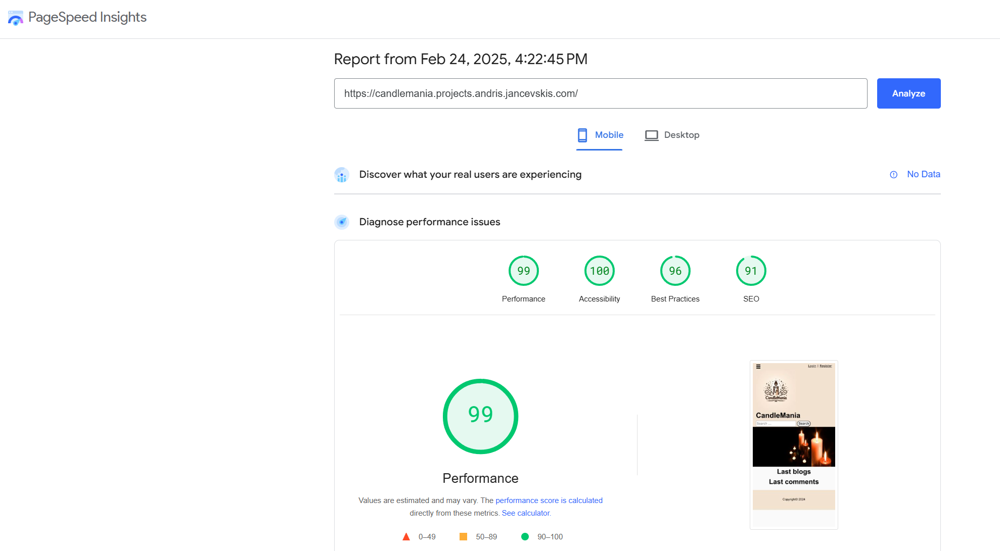
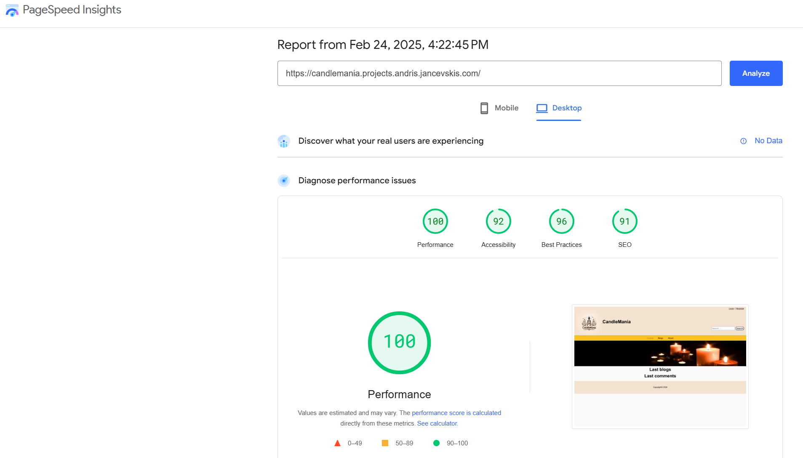

TESTING
=======

Software testing, a crucial step in software development, is the process of evaluating and verifying whether a software application meets its expected requirements and functions correctly, ensuring the end product is of high quality and meets user expectations.

It aims to identify defects, bugs, or missing features in contrast to the specified requirements.

Essentially, it answers two critical questions:

- Is the software built the right way? (does the software correctly implement specific functions?)
- Is it the right product?” (does the software align with customer requirements or user stories?)


This project uses manual testing and acceptance testing.

During **manual testing**, the test operator manually checks if the system works as expected by going through all screens and simulating end-user behaviour. The user interface is also checked for look and feel during this test. In web development, web pages are tested against different screen sizes, browsers, and operation systems.

The functionality of the system can be automated using test scripts. For that purpose, **automated tests** are used. Automated tests are helpful for large projects to ensure the new functionality does not change old behaviour. They increase testing speed but add extra work for writing them. One of the testing frameworks for JavaScript is Jest. Automated tests are not used for this project as the project has no continuity, and writing tests adds extra work.

**Acceptance tests** ensure that all user requirements are met. In this project, they are user stories.

# Standards testing
Standards testing is performed on author's work, not on third party components like _django-tinymce_.
## HTML
**_HTML validator (_**[**_https://validator.w3.org/_**](https://validator.w3.org/)**_)_**

**Home page**

After testing


**Fix**: removed slash from Search and banner tags.

**After fix**: no errors

 **About page**

No errors

**Blogs home**

After testing


**Fix**: charset attribute from script tag in all blog template files. 
Stash error is fixed with base template fix.

**After fix**: no errors

**New Blog**


## CSS
**_Jigsaw CSS validator (_**[**_https://jigsaw.w3.org/css-validator_**](https://jigsaw.w3.org/css-validator)**_)_**

There are two stylesheet files made by author and they are implemented into the files error.css and main.css.
* error.css - no errors found
* main.css - no errors found

## JavaScript
**Formal syntax validation (**[**https://beautifytools.com/javascript-validator.php**](https://beautifytools.com/javascript-validator.php)**)**

There is only one file to check: main.js. Others are third party scripts whicjh is out of author's control.

First check give three categories of errors:
* arrow function syntax (=>)' is only available in ES6 (use 'esversion: 6').

    Solution: added hint at the start of the file: /* jshint esversion: 6 */
* 'e' is defined but never used. (in event listeners)

    Solution: deleted argument 'e' in event listeners
* missing semicolon.

    Solution: add semicolon


## Performance
**_Lighthouse (_**[**_https://web.dev/measure/_**](https://web.dev/measure/)**_)_**

Performance passes without errors for empty home page.

Mobile


Desktop



## Python
To check python code, pylint is used.

Install and usage from project root:
```
pip install pylint
pylint ../candlemania/
```

At first use it showed a long list of errors from all modules in project and virtual environment, 
so author decided to run pylint only on author's modules within project using syntax ```pylint module_name/```.
Tested modules are _blog, candlemania and main_.
### module: blog ###
Initial checking gave long list of errors which can be grouped by following topics:
* Missing module/class docstring
* Line too long
* specific syntax/programming errors

After fixing there are only few errors left with are described in Section "Unfixed Errors".

### Unfixed Errors ###
This section provides list and the reasons why some errors are not fixed.

* W0212: Access to a protected member _meta of a client class (protected-access)
  
  Reason: pylint does not see or understand protected members of inherited class.

* E1101: Class '<class_name>' has no '<member>' member (no-member)

  Reason: pylint does not "see" or understand protected members of inherited class.

*  R0903: Too few public methods (0/2) (too-few-public-methods)

  Program does not need changing other inherited methods 


# Acceptance testing
Testing if software meets user stories (requirements).

These tests are performed manually.

## As a site visitor I need to

| User story ID | User story | Test passed? | Comments                         | Repeated test passed? |
|----------|-------------|--------------|----------------------------------|---------|
| [US-V01] | browse all blogs | Yes          | Site's main page                 | |
| [US-V02] | have a paginator when there are more than 8 items on a page grid mode | Yes | Site's main page and search results | |
| [US-V03] | read the full blog | Yes | Press on blog title in the list | | |

## As a registered user I need to
| User story ID | User story                                              | Test passed? | Comments                                                        | Repeated test passed? |
|---------------|---------------------------------------------------------|--------------|-----------------------------------------------------------------|-----------------------|
| [US-RU01]     | be able to do the same as a visitor can                 | Yes          | User stories US-V01 to US-V03                                   |                       |
| [US-RU02]     | be able to log in                                       | Yes          | Choose a link on the right top corner                           |                       |
| [US-RU03]     | have a registration page                                | Yes          | Choose a link on the right top corner                           |                       |
| [US-RU04]     | write a blog                                            | Yes          | Choose a button "Write blog"                                    |                       |
| [US-RU05]     | update my a blog                                        | Yes          | Press Edit in blog details page                                 |                       |
| [US-RU06]     | delete my a blog                                        | Yes          | Press Delete in blog details page and accept in the next page.  |                       |
| [US-RU07]     | approve blog comments to my posts                       | Yes          | Blog author can approve blog comment by pressing button Approve |                       |
| [US-RU08]     | write blog comments                                     | Yes          | Write a comment in text field and submit                        |                       |
| [US-RU09]     | delete my blog comments                                 | Yes          | Press Delete by the comment                                     |                       |
| [US-RU10]     | have my blogs protected from deleting by other users    | Yes          | Edit button appears only to blog author                         |                       |
| [US-RU11]     | have my comments protected from altering by other users | Yes          | Editing comments is not implemented                             |                       |
| [US-RU12]     | have my comments protected from deleting by other users | Yes          | Delete button appears only to blog author or comment author     |                       |

Testing revealed that comments block has many errors and had to be rewritten.


## As an editor I need to
| User story ID | User story                              | Test passed? | Comments                                             | Repeated test passed? |
|---------------|-----------------------------------------|--------------|------------------------------------------------------|-----------------------|
| [US-A01]      | be able to do the same as a visitor can | Yes          | User stories US-V01 to US-V03 and US-RU01 to US-RU12 |                       |
| [US-A02]      | approve any blogs                       | No           | Approve button was ot showing in blog details.       | Yes                   |
| [US-A03]      | delete any blog                         | No           | Delete button was not showing                        | Yes                   |


## As a superuser I need to
| User story ID | User story                              | Test passed? | Comments                                                                  | Repeated test passed? |
|---------------|-----------------------------------------|--------------|---------------------------------------------------------------------------|-----------------------|
| [US-SU1]      | be able to do the same as a visitor can | Yes          | User stories US-V01 to US-V03 and US-RU01 to US-RU12 and US-A01 to US-A03 |                       |
| [US-SU2]      | grant registered user an editor role    | Yes          | Use admin interface                                                       |                       |
| [US-SU3]      | revoke the editor role                  | Yes          | Use admin interface                                                       |                       |


[Back to README](README.md)
