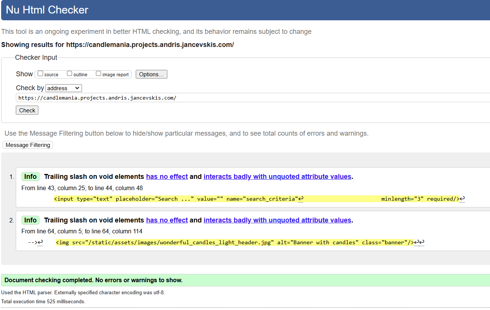
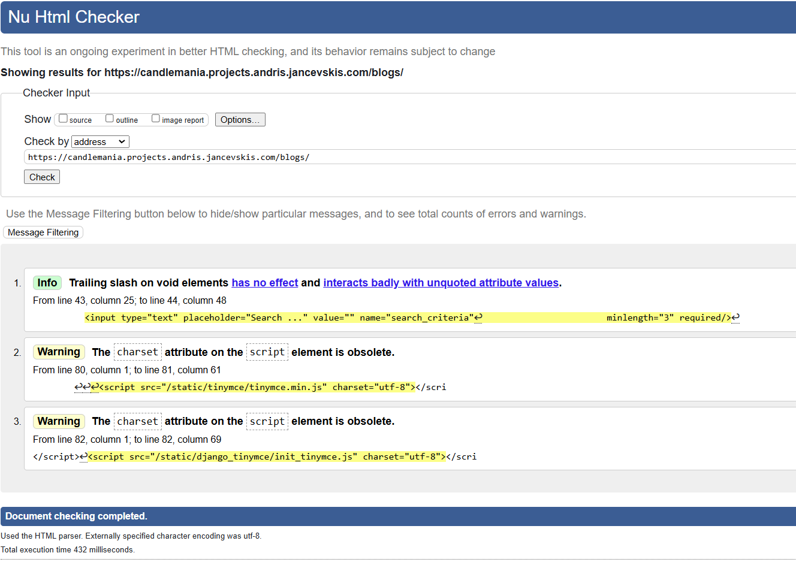

TESTING
=======

Software testing, a crucial step in software development, is the process of evaluating and verifying whether a software application meets its expected requirements and functions correctly, ensuring the end product is of high quality and meets user expectations.

It aims to identify defects, bugs, or missing features in contrast to the specified requirements.

Essentially, it answers two critical questions:

- Is the software built the right way? (does the software correctly implement specific functions?)
- Is it the right product?” (does the software align with customer requirements or user stories?)

This project uses manual testing and acceptance testing.

During **manual testing**, the test operator manually checks if the system works as expected by going through all screens and simulating end-user behaviour. The user interface is also checked for look and feel during this test. In web development, web pages are tested against different screen sizes, browsers, and operation systems.

The functionality of the system can be automated using test scripts. For that purpose, **automated tests** are used. Automated tests are helpful for large projects to ensure the new functionality does not change old behaviour. They increase testing speed but add extra work for writing them. One of the testing frameworks for JavaScript is Jest. Automated tests are not used for this project as the project has no continuity, and writing tests adds extra work.

**Acceptance tests** ensure that all user requirements are met. In this project, they are user stories.

# Standards testing
Standards testing is performed on author's work, not on third party components like _django-tinymce_.
## HTML
**_HTML validator (_**[**_https://validator.w3.org/_**](https://validator.w3.org/)**_)_**

**Home page**

After testing

**Fix**: removed slash from Search and banner tags.

**After fix**: no errors

 **About page**

No errors

**Blogs home**

After testing

**Fix**: charset attribute from script tag in all blog template files. 
Stash error is fixed with base template fix.

**After fix**: no errors

**New Blog**

## CSS
**_Jigsaw CSS validator (_**[**_https://jigsaw.w3.org/css-validator_**](https://jigsaw.w3.org/css-validator)**_)_**

There are two stylesheet files made by author and they are implemented into the files error.css and main.css.
* error.css - no errors found
* main.css - no errors found

## JavaScript
**Formal syntax validation (**[**https://beautifytools.com/javascript-validator.php**](https://beautifytools.com/javascript-validator.php)**)**

There is only one file to check: main.js. Others are third party scripts whicjh is out of author's control.

First check give three categories of errors:
* arrow function syntax (=>)' is only available in ES6 (use 'esversion: 6').

    Solution: added hint at the start of the file: /* jshint esversion: 6 */
* 'e' is defined but never used. (in event listeners)

    Solution: deleted argument 'e' in event listeners
* missing semicolon.

    Solution: add semicolon

## Performance
**_Lighthouse (_**[**_https://web.dev/measure/_**](https://web.dev/measure/)**_)_**

## Python

# Acceptance testing
Testing if software meets user stories (requirements).

[Back to README](README.md)
